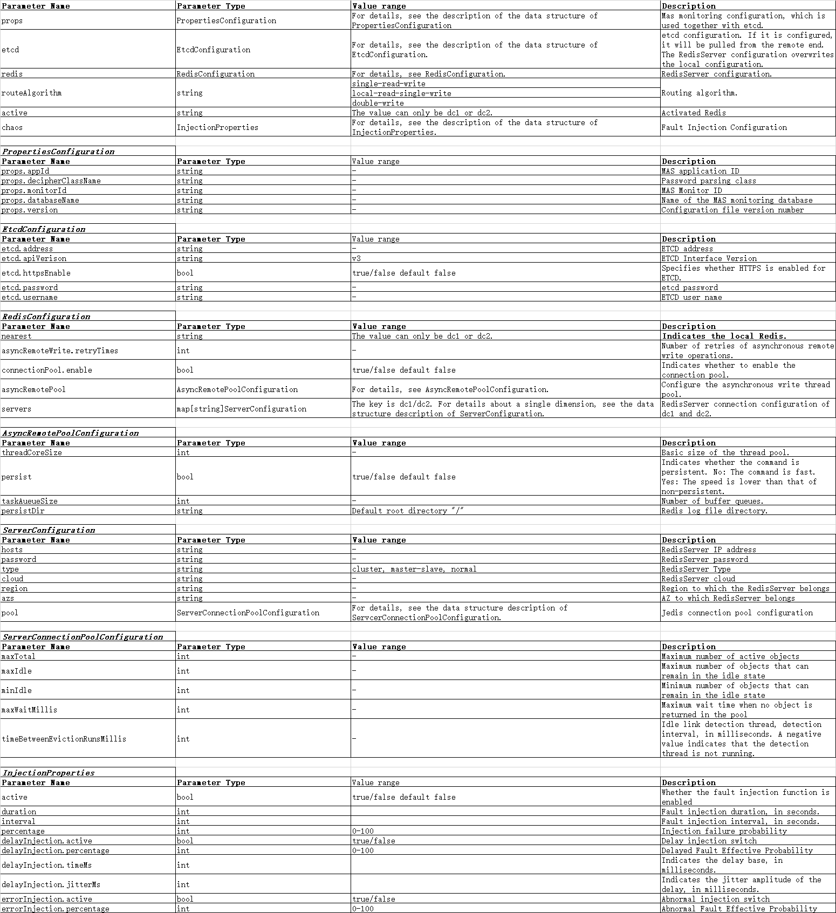

 # devcloud-go/redis

###Introduction
Currently, the Redis supports three modes.single-read-write,local-read-single-write and double-write
##### single-read-write

##### local-read-single-write

##### double-write

### Quickstart：
1. use yaml configuartion file
```bigquery
package main

import (
    "context"
    "time"

    "github.com/huaweicloud/devcloud-go/redis"
)

func main()  {
    ctx := context.Background()
    client := redis.NewDevsporeClientWithYaml("./config_with_password.yaml")
    client.Set(ctx, "test_key", "test_val", time.Hour)
    client.Get(ctx, "test_key")
}
```
2. use code(recommend)
```bigquery
package main

import (
    "context"
    "time"

    goredis "github.com/go-redis/redis/v8"
    "github.com/huaweicloud/devcloud-go/redis"
    "github.com/huaweicloud/devcloud-go/redis/config"
)
func main() {
    servers := map[string]*config.ServerConfiguration{
        "server1": {
            Hosts:      "127.0.0.0:6379",
            Password:   "123456",
            Type:       config.ServerTypeNormal,
            Cloud:      "huawei cloud",
            Region:     "beijing",
            Azs:        "az0",
        },
    }
    configuration := &config.Configuration{
        RedisConfig: &config.RedisConfiguration{
            Servers: servers,
        },
        RouteAlgorithm: "single-read-write",
        Active:         "server1",  
    }

    client := redis.NewDevsporeClient(configuration)
    ctx := context.Background()
    client.Set(ctx, "test_key", "test_val", time.Hour)
    client.Get(ctx, "test_key")
}
```
### Yaml configuration file

```bigquery
props:
  version: v1
  appId: xxx
  monitorId: sdk_test
  cloud: huaweicloud
  region: cn-north-4
  azs: az1 
etcd: # Optional
  address: 127.0.0.1:2379,127.0.0.2:2379,127.0.0.3:2379
  apiVersion: v3
  username: root
  password: root
  httpsEnable: false
redis:
  redisGroupName: xxx-redis-group
  username: xxx # for redis 6.0
  password: yyy
  nearest: dc1
  connectionPool:
    enable: true
  servers:
    dc1:
      hosts: 127.0.0.1:6379
      password: password
      type: normal  # cluster, master-slave, normal
      cloud: huaweicloud  # cloud
      region: cn-north-4  # region id
      azs: az1  # azs
      pool: # Optional
        maxTotal: 100
        maxIdle: 8
        minIdle: 0
        maxWaitMillis: 10000
        timeBetweenEvictionRunsMillis: 1000
    dc2:
      hosts: 127.0.0.1:6380
      password: password
      type: master-slave  # cluster, master-slave, normal
      cloud: huaweicloud  # cloud
      region: cn-north-4  # region id
      azs: az1  # azs
      pool: # Optional
        maxTotal: 100
        maxIdle: 8
        minIdle: 0
        maxWaitMillis: 10000
        timeBetweenEvictionRunsMillis: 1000
routeAlgorithm: single-read-write  # local-read-single-write, single-read-write, double-write
active: dc1
```
### Double-write
Redis also supports double-write modes, including memory double-write and file double-write, 
depending on asyncRemotePool.persist. true: file double-write; false: memory double-write
```bigquery
redis:
  redisGroupName: xxx-redis-group
  username: xxx # for redis 6.0
  password: yyy
  nearest: dc1
  asyncRemoteWrite:
    retryTimes: 4
  connectionPool:
    enable: true
  asyncRemotePool:
    persist: true
    threadCoreSize: 10
    taskQueueSize: 5
    persistDir: dataDir/
  servers:
    dc1:
      hosts: 127.0.0.1:6379
      password:
      type: normal  # cluster, master-slave, normal
      cloud: huaweicloud  # cloud
      region: cn-north-4  # region id
      azs: az1  # azs
      pool: # Optional
        maxTotal: 100
        maxIdle: 8
        minIdle: 0
        maxWaitMillis: 10000
        timeBetweenEvictionRunsMillis: 1000
    dc2:
      hosts: 127.0.0.1:6380
      password:
      type: normal  # cluster, master-slave, normal
      cloud: huaweicloud  # cloud
      region: cn-north-4  # region id
      azs: az1  # azs
      pool: # Optional
        maxTotal: 100
        maxIdle: 8
        minIdle: 0
        maxWaitMillis: 10000
        timeBetweenEvictionRunsMillis: 1000
routeAlgorithm: double-write  # local-read-single-write, single-read-write, double-write
active: dc2
```
### Fault injection
Redis also supports the creation of services with fault injection. The configuration is similar to that of MySQL.
```bigquery
func DCRedis(etcdAddrs, redisAddrs []string) *redisconfig.Configuration {
    servers := make(map[string]*redisconfig.ServerConfiguration)
    for i, addr := range redisAddrs {
        stri := strconv.Itoa(i + 1)
        servers["ds"+stri] = &redisconfig.ServerConfiguration{
            Hosts:    addr,
            Password: "123456",
            Type:     redisconfig.ServerTypeNormal,
            Cloud:    "huawei cloud",
            Region:   "beijing",
            Azs:      "az1",
        }
    }
    configuration := &redisconfig.Configuration{
        RedisConfig: &redisconfig.RedisConfiguration{
            Servers: servers,
        },
        RouteAlgorithm: "single-read-write",
        Active:         "ds1",
        Chaos: &mas.InjectionProperties{
            Active:     true,
            Duration:   50,
            Interval:   100,
            Percentage: 100,
            DelayInjection: &mas.DelayInjection{
                Active:     true,
                Percentage: 100,
                TimeMs:     1000,
                JitterMs:   500,
            },
            ErrorInjection: &mas.ErrorInjection{
                Active:     true,
                Percentage: 30,
            },
        },
    }
    return configuration
}
```
Alternatively, add the following configuration to the configuration file:
```bigquery
chaos:
  active: true
  duration: 50
  interval: 100
  percentage: 100
  delayInjection:
    active: true
    percentage: 100
    timeMs: 1000
    jitterMs: 500
  errorInjection:
    active: true
    percentage: 20
```
### Testing
package commands_test needs redis 6.2.0+, so if your redis is redis 5.0+, you need to execute 
```bigquery
ginkgo -skip="redis6" 
```
See more usages of ginkgo in **https://github.com/onsi/ginkgo**

###Description of Configuration Parameters
