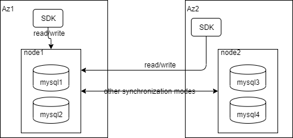
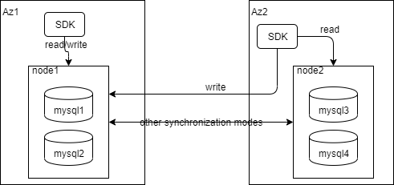

# devcloud-go/sql-driver/mysql

### Introduction
Currently, MySQL supports two modes.single-read-write and local-read-single-write.
In addition, read/write separation is supported, which can be configured as random or RoundRobin.
##### single-read-write

##### local-read-single-write

### Quickstart：
```bigquery
import (
    "gorm.io/driver/mysql"
    "gorm.io/gorm"
    "github.com/huaweicloud/devcloud-go/common/etcd"
    "github.com/huaweicloud/devcloud-go/mas"
    devspore "github.com/huaweicloud/devcloud-go/sql-driver/mysql"
    "github.com/huaweicloud/devcloud-go/sql-driver/rds/config"
)

func main()  {
    devspore.SetClusterConfiguration(devsporeConfiguration())
    var err error
    db, err = gorm.Open(mysql.New(mysql.Config{
    	DriverName: "devspore_mysql",
    	DSN:        "",
    }), &gorm.Config{})
    log.Printf("create db failed, %v", err)
}
func devsporeConfiguration() *config.ClusterConfiguration {
    return &config.ClusterConfiguration{
        Props: &mas.PropertiesConfiguration{
            AppID:        "xxx",
            MonitorID:    "xxx",
            DatabaseName: "xx",
        },
    	EtcdConfig: &etcd.EtcdConfiguration{
            Address:     "127.0.0.1:2379,127.0.0.2:2379,127.0.0.3:2379",
            Username:    "etcduser",
            Password:    "etcdpwd",
            HTTPSEnable: false,
    	},
    	RouterConfig: &config.RouterConfiguration{
            Nodes: map[string]*config.NodeConfiguration{
                "dc1": {
                    Master: "ds1",
                },
                "dc2": {
                    Master: "ds2",
                },
            },
            Active: "dc1",
    	},
    	DataSource: map[string]*config.DataSourceConfiguration{
            "ds1": {
                URL:      "tcp(127.0.0.1:3306)/ds0?charset=utf8&parseTime=true",
                Username: "root",
                Password: "123456",
            },
            "ds2": {
                URL:      "tcp(127.0.0.1:3307)/ds0?charset=utf8&parseTime=true",
                Username: "root",
                Password: "123456",
            },
    	},
    }
}

```
you also can use yaml file.
```bigquery
1.sql
import (
    "database/sql"
    "fmt"

    "github.com/huaweicloud/devcloud-go/common/password"
    _ "github.com/huaweicloud/devcloud-go/sql-driver/mysql"
)

func main() {
    password.SetDecipher(&MyDecipher{}) //MyDecipher implements password.Decipher interface
    yamlConfigPath := "xxx/config_with_password.yaml"
    db, err := sql.Open("devspore_mysql", yamlConfigPath)
    if err != nil {
        fmt.Errorf(err.Error())
    }
    ......THEN 
}

2.gorm
import (
    "gorm.io/driver/mysql"
    "gorm.io/gorm"
    _ "github.com/huaweicloud/devcloud-go/sql-driver/mysql"
)

func main() {
    db, err := gorm.Open(mysql.New(mysql.Config{
        DriverName: "devspore_mysql",
        DSN:        "xxx/config_with_password.yaml",
    }), &gorm.Config{})
    ......THEN 
}

3.beego-orm
import (
	"log"

	"github.com/astaxie/beego/orm"
	_ "github.com/huaweicloud/devcloud-go/sql-driver/mysql"
)

func main() {
    // register devspore_mysql
    err = orm.RegisterDriver("devspore_mysql", orm.DRMySQL)
    if err != nil {
        log.Fatalln(err)
    }
    // register model
    orm.RegisterModel(new(interface{}),new(interface{}))
    
    err = orm.RegisterDataBase("default", "devspore_mysql", "xxx/config_with_password.yaml")
    if err != nil {
        log.Fatalln(err)
    }
    db:= orm.NewOrm()
    ......THEN 
}

```
**Version requirements：go1.14.6 and above**

### Configuration file format：
you can just configure datasource and router if you don't use mas.
```bigquery
props: # Optional
  version: v1  // project version
  appId: xxxxx  // mas appId
  monitorId: xxxxx  // mas monitorId
  databaseName: xxxxx  // dbName

etcd: # Optional
  address: 127.0.0.2:2379,127.0.0.2:2379,127.0.0.2:2379  
  apiVersion: v3  // etcd version
  username: etcduser  
  password: etcdpwd  
  httpsEnable: false  
  
datasource: # Require
  ds0:
    url: tcp(127.0.0.1:8080)/ds0 
    username: datasourceuser 
    password: datasourcepwd  
  ds0-slave0:
    url: tcp(127.0.0.1:8080)/ds0_slave0
    username: datasourceuser
    password: datasourcepwd
  ds0-slave1: 
    url: tcp(127.0.0.1:8080)/ds0_slave1
    username: datasourceuser
    password: datasourcepwd
  ds1:
    url: tcp(127.0.0.1:8080)/ds1
    username: datasourceuser
    password: datasourcepwd
  ds1-slave0:
    url: tcp(127.0.0.1:8080)/ds1_slave0
    username: datasourceuser
    password: datasourcepwd
  ds1-slave1:
    url: tcp(127.0.0.1:8080)/ds1_slave1
    username: datasourceuser
    password: datasourcepwd

router: # Require
  active: c0 
  routeAlgorithm: single-read-write  // single-read-write(default), local-read-single-write
  retry:
    times: 3  
    delay: 50  // ms
  nodes:
    c0:  
      weight: ""  // not yet used
      master: ds0  // 
      loadBalance: ROUND_ROBIN  // ROUND_ROBIN(default),RANDOM
      slaves:  
        - ds0-slave0
        - ds0-slave1
    c1:
      weight: ""
      master: ds1
      loadBalance: ROUND_ROBIN
      slaves:
        - ds1-slave0
        - ds1-slave1

```

### Fault injection
You can also create a database service with injection failures by adding configurations.
```bigquery
func devsporeConfiguration() *config.ClusterConfiguration {
    return &config.ClusterConfiguration{
        Props: &mas.PropertiesConfiguration{
            AppID:        "xxx",
            MonitorID:    "xxx",
            DatabaseName: "xx",
        },
        EtcdConfig: &etcd.EtcdConfiguration{
            Address:     "127.0.0.1:2379,127.0.0.2:2379,127.0.0.3:2379",
            Username:    "etcduser",
            Password:    "etcdpwd",
            HTTPSEnable: false,
        },
        RouterConfig: &config.RouterConfiguration{
            Nodes: map[string]*config.NodeConfiguration{
                "dc1": {
                    Master: "ds1",
                },
                "dc2": {
                    Master: "ds2",
                },
            },
            Active: "dc1",
        },
        DataSource: map[string]*config.DataSourceConfiguration{
            "ds1": {
                URL:      "tcp(127.0.0.1:3306)/ds0?charset=utf8&parseTime=true",
                Username: "root",
                Password: "123456",
            },
            "ds2": {
                URL:      "tcp(127.0.0.1:3307)/ds0?charset=utf8&parseTime=true",
                Username: "root",
                Password: "123456",
            },
        },
        Chaos: &mas.InjectionProperties{
            Active:     true,
            Duration:   50,
            Interval:   100,
            Percentage: 100,
            DelayInjection: &mas.DelayInjection{
                Active:     true,
                Percentage: 75,
                TimeMs:     1000,
                JitterMs:   500,
            },
            ErrorInjection: &mas.ErrorInjection{
                Active:     true,
                Percentage: 30,
            },
        },
    }
}
```
Alternatively, add the following configuration to the configuration file:
```bigquery
chaos:
  active: true
  duration: 20
  interval: 100
  percentage: 100
  delayInjection:
    active: true
    percentage: 75
    timeMs: 1000
    jitterMs: 500
  errorInjection:
    active: true
    percentage: 20
```

### Description of Configuration Parameters
|表头|表头|
|-|-|
